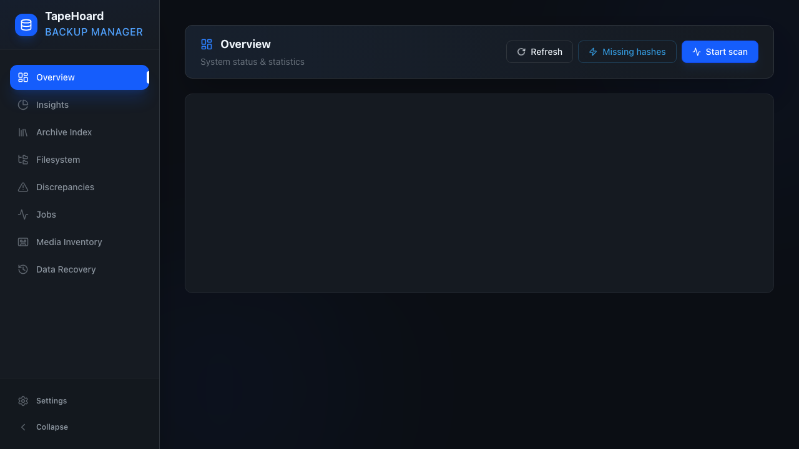
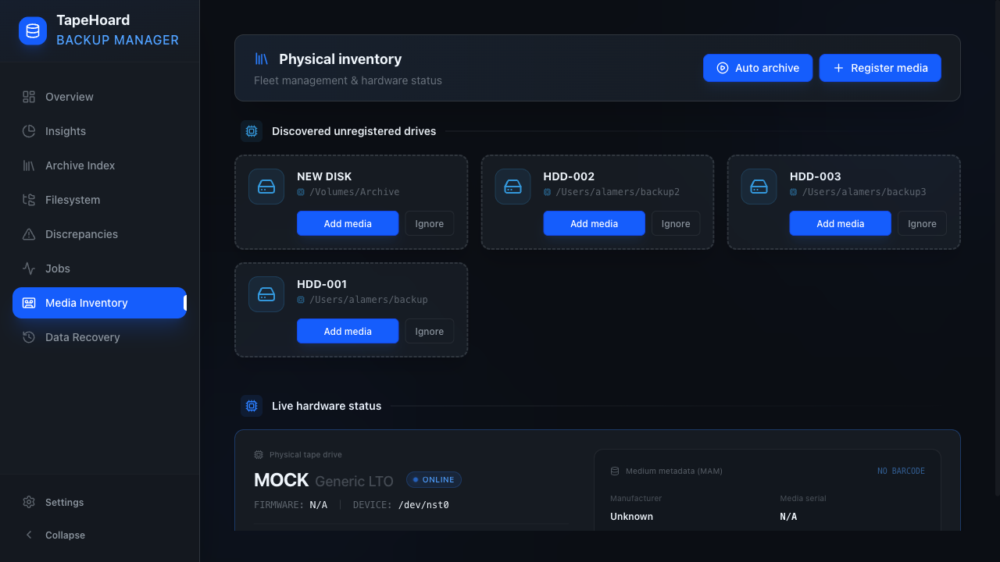
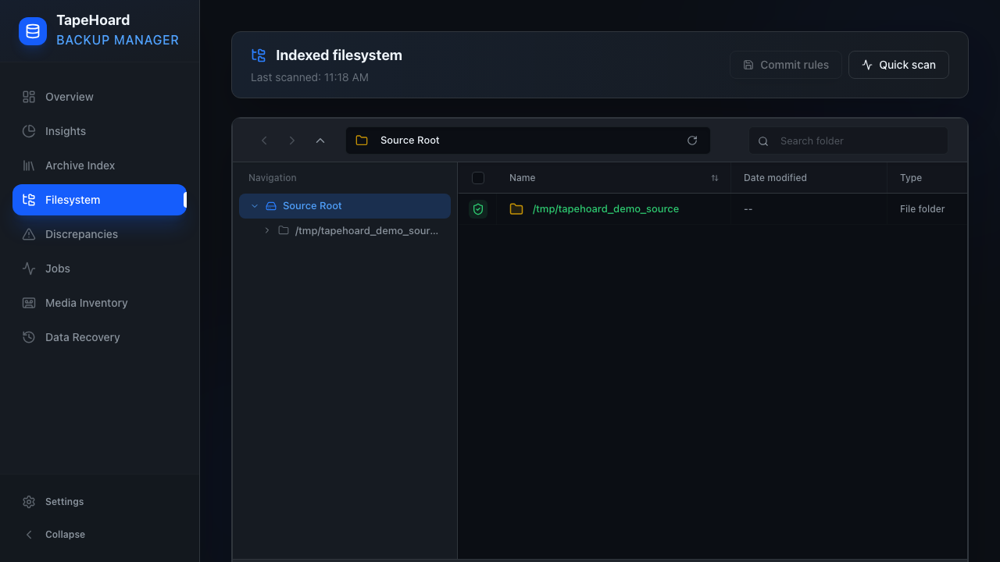
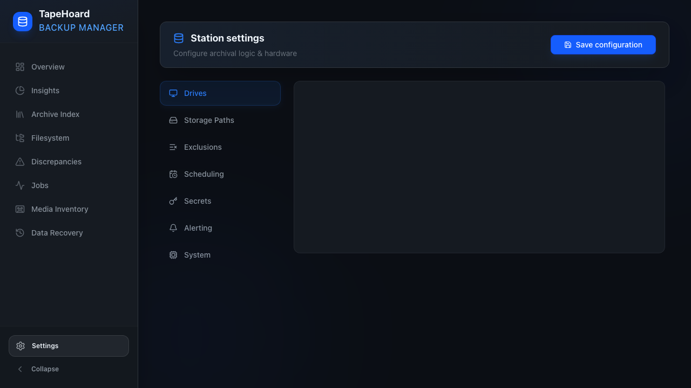

# TapeHoard

> Physical media archival for people who don't trust the cloud alone.

**TapeHoard is not just for tapes.** It's a self-hosted backup manager for any offline-capable storage you already own:

- **Offline HDDs / USB drives** — Any mountable filesystem (ext4, NTFS, APFS, exFAT)
- **S3-compatible cloud** — Encrypted copies on Wasabi, Backblaze B2, MinIO, or any S3-compat provider
- **LTO tape** — If you happen to own a tape drive like some of us do

It indexes your source filesystems, tracks what has been archived to which medium, and gives you a searchable catalog—even when the media itself is sitting in a vault across town.



## Features

- **Index-First Design** — All browsing, searching, and discrepancy checks run against the database. The live filesystem is only touched during scans.
- **Any Storage You Own** — HDDs, USB drives, S3-compatible cloud, or LTO tape. All managed in one inventory. Auto-archival fills media in the order you define.
- **LTO Tape Native** — Barcode discovery via MAM, hardware compression control, and direct SCSI streaming. No intermediary disk staging required for sequential writes.
- **Redundancy-Aware** *(planned)* — Target N copies across active media. TapeHoard will distribute files until every byte has the redundancy you specify.
- **Restore Queue** — Stage files for recovery from any combination of media. Get a minimum-media manifest so you only mount what you need.
- **Discrepancy Detection** — Find files that have gone missing, changed without a new backup, or been excluded by policy.
- **Encrypted at Rest** — Per-media encryption secrets managed through a built-in keystore. Compatible with LTO hardware encryption (`stenc`) and client-side cloud encryption.

## Screenshots

| Dashboard | Media Inventory |
|---|---|
|  |  |

| Live Filesystem | System Settings |
|---|---|
|  |  |

## Quick Start (Docker Compose)

The recommended deployment is a single container with persistent volumes for the database, staging area, and source/restore mounts.

```yaml
services:
  tapehoard:
    image: ghcr.io/tapehoard/tapehoard:latest
    container_name: tapehoard
    cap_add:
      - SYS_RAWIO
    devices:
      - /dev/nst0:/dev/nst0
    environment:
      - TZ=UTC
      - DATABASE_URL=sqlite:////database/tapehoard.db
      - STAGING_DIRECTORY=/staging
    ports:
      - '30265:8000'
    volumes:
      - ./database:/database
      - ./staging:/staging
      - /mnt/archive:/source_data:ro
      - /mnt/restores:/restores
```

### Requirements

- **Linux host** (LTO tape support requires `mt`, `sg_read_attr`, and optionally `stenc` on the host or in the container)
- **SYS_RAWIO capability** — Required for direct SCSI access to tape drives
- **Device passthrough** — Map `/dev/nst0` (or your tape device) into the container
- **Persistent volumes** — Database and staging must survive container restarts

### Hardware-Specific Notes

**HDDs / USB Drives (Recommended for most users):**
- Mount the drive filesystem into the container at `/source_data` or a restore destination
- The HDD provider reads a `.tapehoard_id` file on the drive root to identify media
- No special capabilities required — works on any Linux, macOS, or Docker host

**S3-Compatible Cloud:**
- Configure endpoint URL, bucket, region, and access credentials in settings
- Optional client-side filename obfuscation and encryption

**LTO Tape (For the dedicated):**
- The container must run as root or have access to the SCSI device node
- Requires `SYS_RAWIO` capability for direct SCSI access
- Set `TAPEHOARD_TEST_MODE=true` to enable a mock LTO provider for development without hardware

### First Run

1. Start the container: `docker compose up -d`
2. Open `http://host:30265`
3. Go to **Settings → Drives** and configure your tape drive path and source roots
4. Trigger an initial scan from the dashboard
5. Register media under **Physical Inventory**
6. Run your first backup

## Development

TapeHoard uses [`just`](https://github.com/casey/just) as its command runner. Install it (`brew install just` or `cargo install just`), then run `just` to see all available commands.

### Common Tasks

```bash
just dev          # Start backend + frontend with hot reload
just backend      # Start only the backend
just frontend     # Start only the frontend
just test         # Run linting, backend tests, and E2E tests
just lint         # Run Ruff, ty, and Svelte checks
just format       # Auto-format Python code
just generate-client   # Regenerate TypeScript SDK from OpenAPI spec
```

### Database Migrations

```bash
just db-upgrade                    # Apply pending migrations
just db-migrate "add user table"   # Autogenerate a new migration
```

## Why TapeHoard?

Most backup tools are built for always-online replication. TapeHoard is built for media you can unplug:

- **Air-gappable** — Pull the drive or tape, store it offline. Your index stays searchable even when the media is in a vault.
- **Auditability** — Every file's SHA-256, every version's offset on every medium, tracked in SQLite.
- **No vendor lock-in** — Standard tar archives on tape, standard files on disk, standard S3 objects in cloud. If TapeHoard disappears, your data doesn't.
